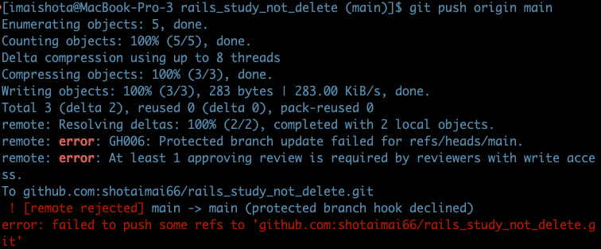

# 1. rails6の環境構築
## 要件
- railsのバージョンは6系
- rubyのバージョンは3系
- rbenvでrubyのバージョン管理をしていること
- Dockerは使用しないこと
- cloud9か自分PCのローカル環境で開発をすること

## 終了条件
- ルートパスにアクセスして、hello worldが表示されていること
- 自分のアカウントにリポジトリを新規に作成して、そのリポジトリのmainブランチにpushされていること

# 2. githubのリポジトリの設定
## 要件
- リポジトリのmainブランチをプロテクトすること

## 終了条件
- 適当なコミットを作ってローカルからmainブランチにpushができないこと（以下のようなエラーが表示されること）

# 3. gem 'devise'を使ったログイン機能の実装（その１）
## 要件
- 作業ブランチ(feat/devise_1)を切って作業すること
- Userモデルを作成すること
  - カラム
    - nameカラムとemailとpasswordカラムがあること（全部必須項目）
- ユーザー作成機能
  - ユーザーの作成が画面上からできること
- ログイン機能
  - ユーザー作成後、認証用のメールが送信されること
    - gem 'letter_opener_web'を利用して、ブラウザで送信したメールが確認できること
  - emailとパスワードでログインができること
- その他のdeviseの機能は以下の画面遷移図のようになっていること
  - https://drive.google.com/file/d/1nYdkRKAWuWW308XT2ea4XhEPGgM4Uaxe/view?usp=sharing
- 完成後の作業ブランチからmainブランチにPRをあげ、その後マージすること

## 終了条件
- 要件が満たされていること

# 4. gem 'devise'を使ったログイン機能の実装（その2）
## 要件
- ローカルに最新のmainブランチをpullすること
- mainブランチから作業ブランチ(feat/devise_2)を切って作業すること
- bootstrap5の適応
  - deviseの画面のフォームとボタンをbootstrapに適応させること
- 画面遷移とサンプル画面は以下のリンクの画面遷移図の要件通りに実装すること
  - https://drive.mindmup.com/map/1SgJDPc8nc90wh2BxfKaLLCdHtmeCJcv-
- 完成後の作業ブランチからmainブランチにPRをあげ、その後マージすること

## 終了条件
- 要件が満たされていること

# 5. 記事CRUD機能の作成
## 要件
- ローカルに最新のmainブランチをpullすること
- mainブランチから作業ブランチ(feat/crud1)を切って作業すること
- 記事テーブル(article)を作成すること。カラムは以下の通り。
  - id: 主キー
  - title: string型, タイトル, not_null制約, 10文字以内
  - content: text型, 本文, not_null制約
  - 画像のカラム（自分で考える）
- 記事の投稿に画像を1枚添付できるようにすること
- users/article_controllerを作成してCRUD機能を作ること（アクションは以下の通り）
  - index(一覧画面)
  - show(詳細画面)
  - new(新規作成画面)
  - create(新規作成処理)
  - edit(編集画面)
  - update(更新処理)
  - destroy(削除処理)
- 画面遷移とサンプル画面は以下のリンクの画面遷移図の要件通りに実装すること
  - https://drive.mindmup.com/map/1px1JibPFvo3NJeqobtLC9ZYrxZV7FCrh
- users/articles_controllerの処理はログインユーザーのみ受け付けること
  - ログインユーザーでなければユーザーログイン画面にリダイレクトすること
- 完成後の作業ブランチからmainブランチにPRをあげ、その後マージすること

## 終了条件
- 要件が満たされていること
